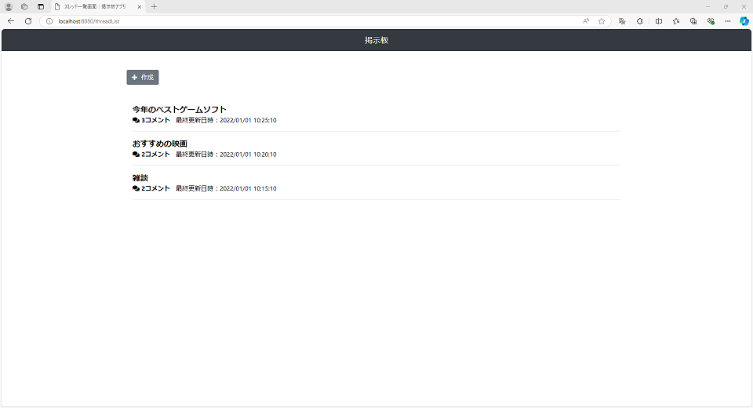
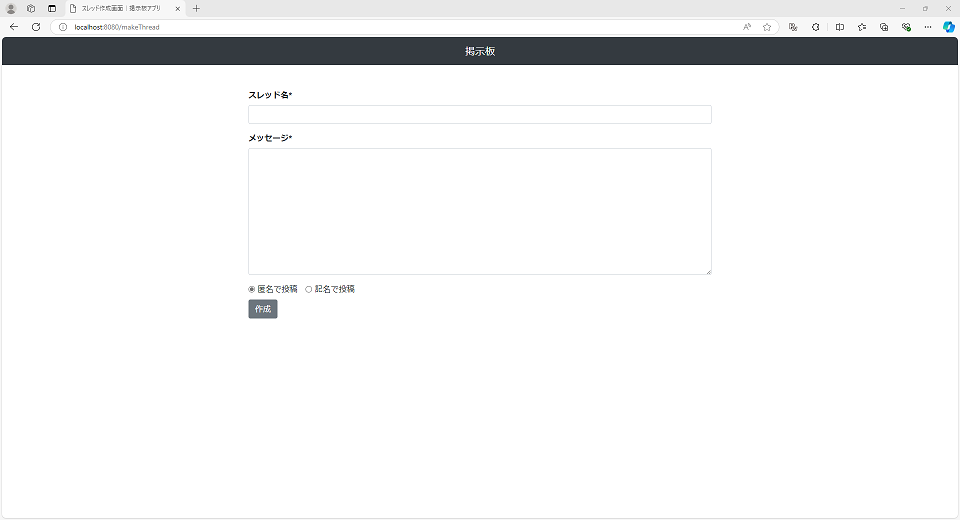
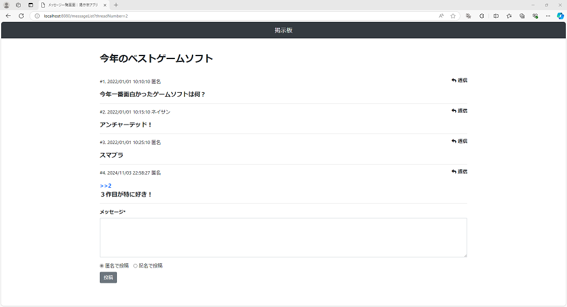

## 掲示板アプリ

### 概要

- スレッドを作成し、メッセージのやり取りが出来る.

### 画面

#### 掲示板一覧画面

URL：http://localhost:8080/threadList

- スレッドの一覧を見ることができる。
- スレッド作成画面に遷移することができる。

#### スレッド作成画面

URL：http://localhost:8080/makeThread

- スレッドの新規作成ができる。

#### メッセージ一覧画面

URL：http://localhost:8080/messageList?threadNumber=2

- 対象スレッドのメッセージを見ることができる。
- メッセージ投稿ができる。

### 構成

- spring boot：Ver2.6.2
  - maven
  - h2
- html
- css
  - boot strap：Ver4.6.1
- font awesome：Ver5.10.0
- javascript

### 使用方法

1. Eclipse のワークスペースタブで右クリックして「インポート」を選択
2. インポートウィンドウで Maven/既存 Maven プロジェクトを選択
3. インポートしたプロジェクトを右クリックして、実行／Spring Boot アプリケーション
